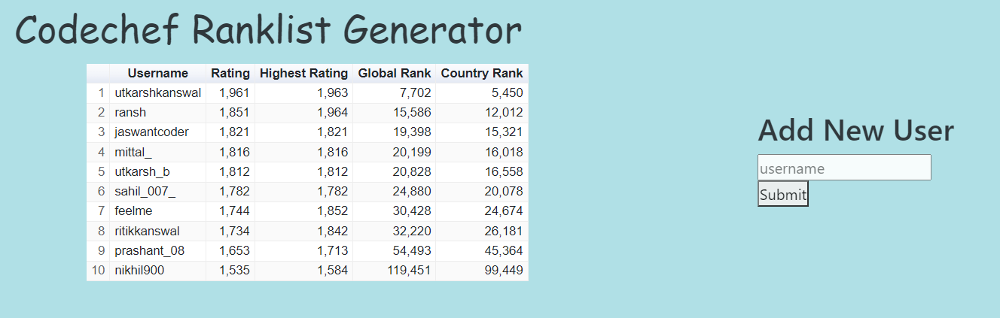
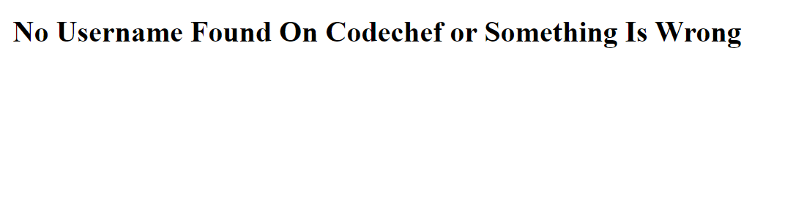

# Codechef Ranklist Generator
A FullStack Application in which users can generate ranklist using Codechef username.Used Django and Django Rest for backend APIs and SQLite as a database to store user Information.
## Wants To Use Without Intstalling I have Deployed This Application on Heroku

### If user name is not found then it's Shows Error.

